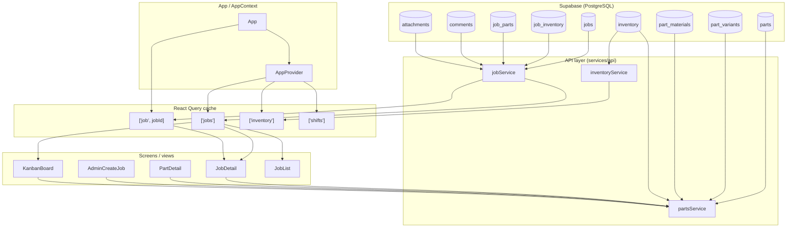
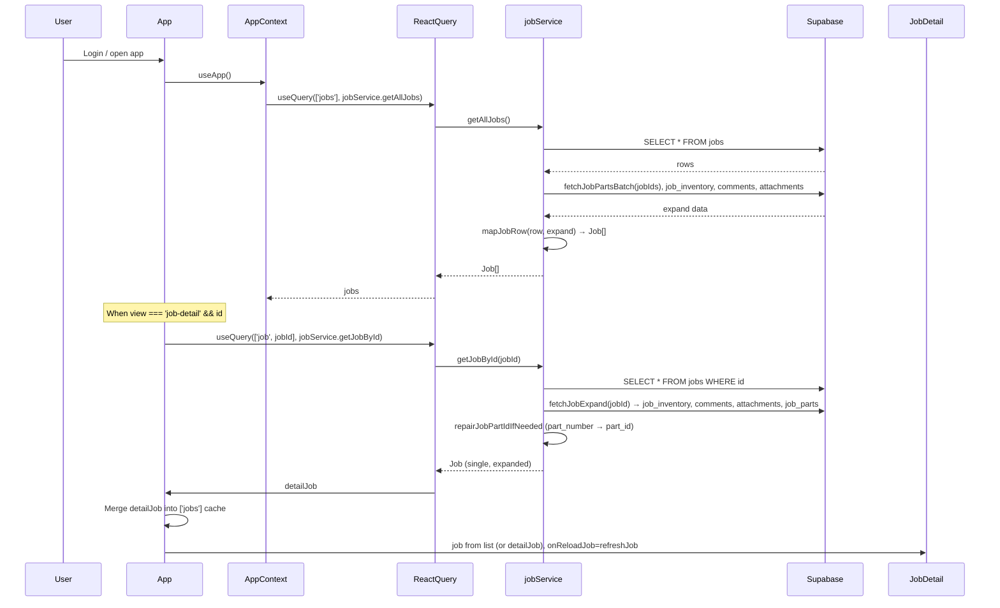
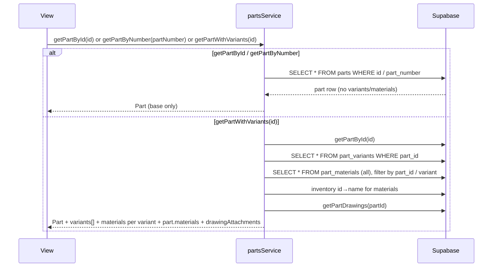

# Job and Part Data Flow

How job and part data is pulled from Supabase and used across the app.

## High-level flow



## Job data pull



**Job data sources:**

| Source | Used by | What it provides |
|-------|---------|-------------------|
| `jobService.getAllJobs()` | AppContext → `jobs` | All jobs; batch-expands job_inventory, comments, attachments, job_parts per job |
| `jobService.getJobById(jobId)` | App (useQuery when on job-detail) | Single job + full expand; repairs part_id from part_number if needed |
| `jobService.getJobByCode(code)` | Clock-in by code, AppContext | Single job by job_code |
| `refreshJob(jobId)` | JobDetail (onReloadJob) | Refetches one job and updates both `['job', id]` and `['jobs']` cache |

**Job shape after load:**  
`Job` = row from `jobs` + `inventoryItems` (from job_inventory), `comments`, `attachments`, `parts` (from job_parts: part_number, part_id, dash_quantities). Primary part is also on the job as `partNumber`, `partId`, `dashQuantities` (from first part or legacy fields).

## Part data pull



**Part data sources:**

| Source | Used by | What it provides |
|-------|---------|-------------------|
| `partsService.getPartById(id)` | — | Part row only (no variants/materials) |
| `partsService.getPartByNumber(partNumber)` | JobDetail (resolve part), PartSelector, PartDetail (by number) | Part row only; case-insensitive fallback |
| `partsService.getPartWithVariants(id)` | JobDetail (load linked part), PartDetail (by id), PartSelector (after getPartByNumber), AdminCreateJob | Part + variants + part.materials + variant.materials + inventory names + drawings |

**Part shape (with variants):**  
`Part` + `variants[]` (PartVariant with `materials[]`) + `materials[]` (part-level BOM) + `drawingAttachments`.

## Where job + part are used together

```mermaid
flowchart LR
  subgraph JobDetail["JobDetail (Edit Job)"]
    J_job[job from props / detailJob]
    J_loadPart[loadLinkedPart(partNumber or partId)]
    J_part[linkedPart = getPartWithVariants]
    J_effective[effectiveMaterialQuantities = buildEffectivePartQuantities]
    J_materialCost[displayMaterialTotal = computePartDerivedMaterialTotal]
    J_partPrice[partDerivedPrice = calculateJobPriceFromPart]
  end

  J_job --> J_loadPart
  J_loadPart --> J_part
  J_job --> J_effective
  J_part --> J_effective
  J_part --> J_materialCost
  J_effective --> J_materialCost
  J_part --> J_partPrice
  J_effective --> J_partPrice
```

| Screen | Job data | Part data |
|--------|----------|-----------|
| **JobDetail** | `job` from App (list merged with detailJob); `onReloadJob` → `refreshJob` | `loadLinkedPart(job.partNumber \|\| job.partId)` → `partsService.getPartWithVariants`; used for BOM, material cost, part-derived price, labor defaults |
| **AdminCreateJob** | Creates job; may pass `parts` with dashQuantities | PartSelector → `getPartByNumber` then `getPartWithVariants`; `buildEffectiveQuantities` for pricing |
| **PartDetail** | Jobs list passed in; show jobs using this part | `getPartWithVariants(partId)` or `getPartByNumber(partId)` then by id; variant/set pricing, BOM |
| **KanbanBoard** | `jobs` from context | Optional part lookup by part_number for display (part name, etc.) |

## Summary

- **Jobs** are loaded in **AppContext** via `jobService.getAllJobs()` (with batch-expanded job_inventory, job_parts, comments, attachments) and cached in `['jobs']`. When the user opens a job, **App** also fetches that job with `jobService.getJobById` into `['job', jobId]` and merges it into the list so JobDetail gets the full, repaired job (including part_id repair).
- **Parts** are not cached globally; they are loaded on demand by **JobDetail** (linked part), **PartDetail** (current part), **PartSelector**, and **AdminCreateJob** via `partsService.getPartByNumber` and `partsService.getPartWithVariants`. Full part (with variants and materials) is used for BOM, material cost, set/variant pricing, and labor defaults.
- **Material cost on Edit Job** comes from `computePartDerivedMaterialTotal(linkedPart, effectiveMaterialQuantities, inventoryById, materialUpcharge)` when a part is linked; otherwise from job inventory line items. **effectiveMaterialQuantities** is built from `job.dashQuantities` / `job.parts[0].dashQuantities` and `job.qty` via `buildEffectivePartQuantities`.
